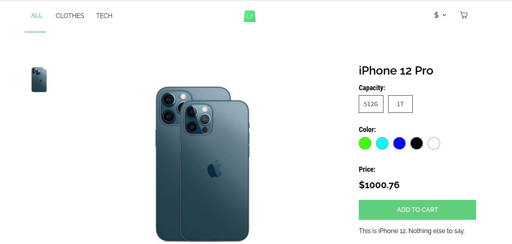
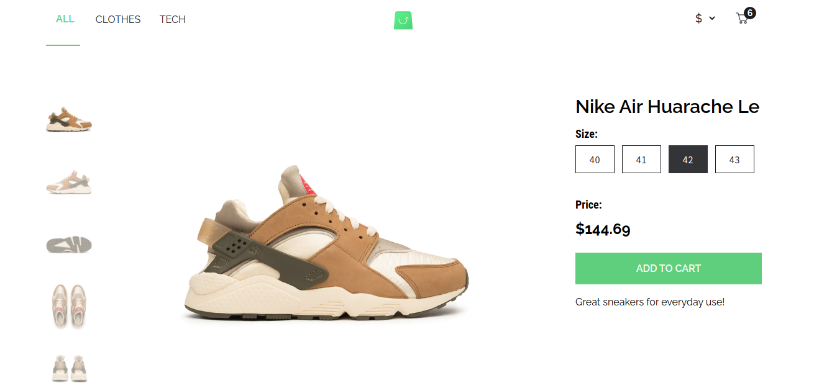
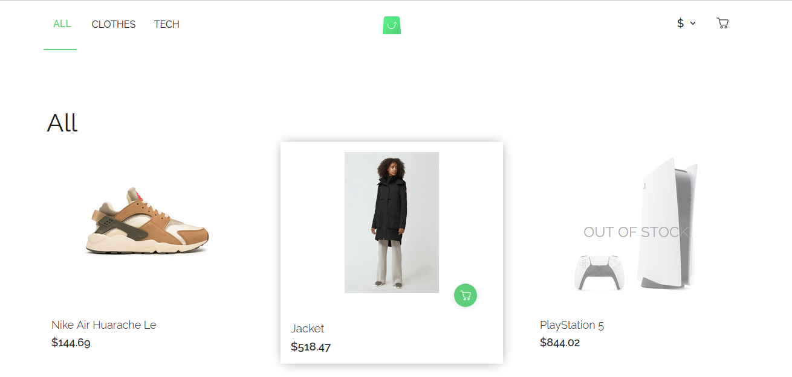
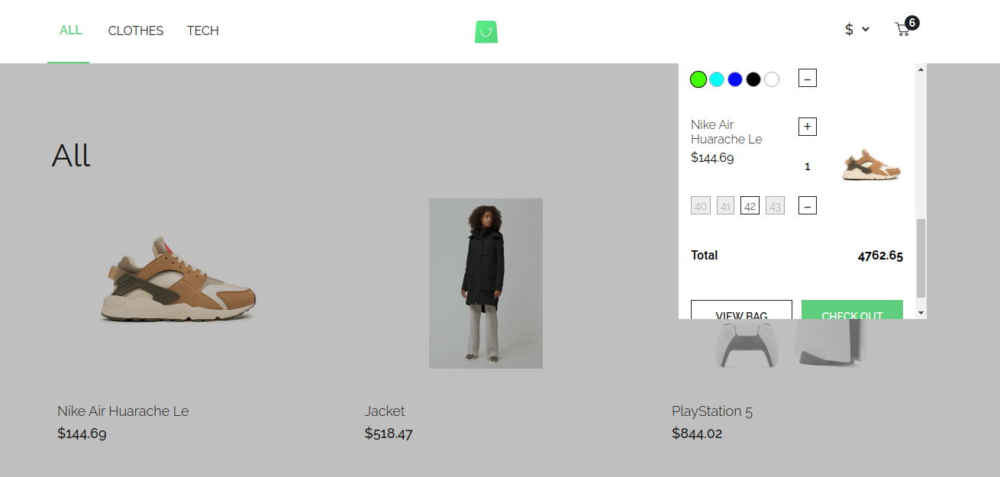
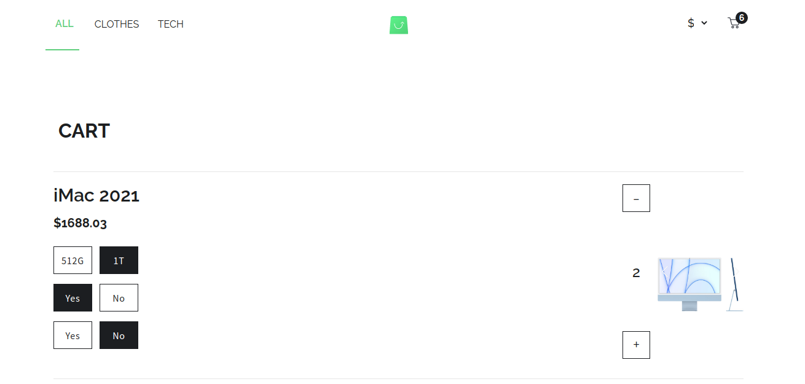

# E-commerce Store
An online store app written in React with the usage of GraphQL and Apollo Client

## Table of contents

- [Overview](#overview)
  - [Requirements](#requirements)
  - [What I learned](#what-i-learned)
  - [Previews](#previews)
    - [Desktop demo](#desktop-demo)
    - [Mobile demo](#mobile-demo)
  - [Local installation](#local-installation)
  - [Useful resources](#useful-resources)

## Overview

### Requirements
The user should be able to

:round_pushpin: Add products to the cart from home page (PLP), product description page (PDP), Cart modal and on the cart page itself and change their amount
The user should be able to add products to the cart from home page (PLP), product description page (PDP), Cart modal and on the cart page itself and change their amount

:round_pushpin: Add product from PLP to cart without selecting the attributes

:round_pushpin: View selected attributes should be visible in cart modal and on the cart page

:round_pushpin: Filter the products by category

:round_pushpin: Change the currency

### What I learned
:round_pushpin: State management and lifecycle methods in class components

:round_pushpin: Persisting state between page reloads using web storage

:round_pushpin: Product filtering

:round_pushpin: Working with modal window and managing page background on modal opening

:round_pushpin: Creating image galleries with scroll behavior

### Previews

#### Desktop demo

https://user-images.githubusercontent.com/15348166/159114238-dda8c92d-7f0e-4cc6-8232-f45f40a8ef2a.mov

Product description pages

 

 

Product listing page

 

Cart modal

 

Cart page

 

#### Mobile demo

https://user-images.githubusercontent.com/15348166/159114362-e9ea3bc7-0b1e-413a-a805-3dde9cb5fe8a.mov

### Local installation

:information_source: If you would like to run this project locally, first please clone the [GraphQL endpoint](https://github.com/scandiweb/junior-react-endpoint) to your machine and install dependencies with `npm install` and then run the server with `npm run start` command. The server will be ready at [http://localhost:4000](http://localhost:4000)

:information_source: To run the client, clone the [project repository](https://github.com/olesiakissa/olesia-kissa-react-online-store) and install dependencies and run it the same way.
Then you can open [http://localhost:3000](http://localhost:3000) to view it in your browser

### Useful resources
Links for the quick reference and the further improvements
- [Get Started with Apollo Client](https://www.apollographql.com/docs/react/get-started/)

- [Products pagination](https://www.apollographql.com/docs/react/pagination/core-api/#the-fetchmore-function)

- [React component](https://reactjs.org/docs/react-component.html)
